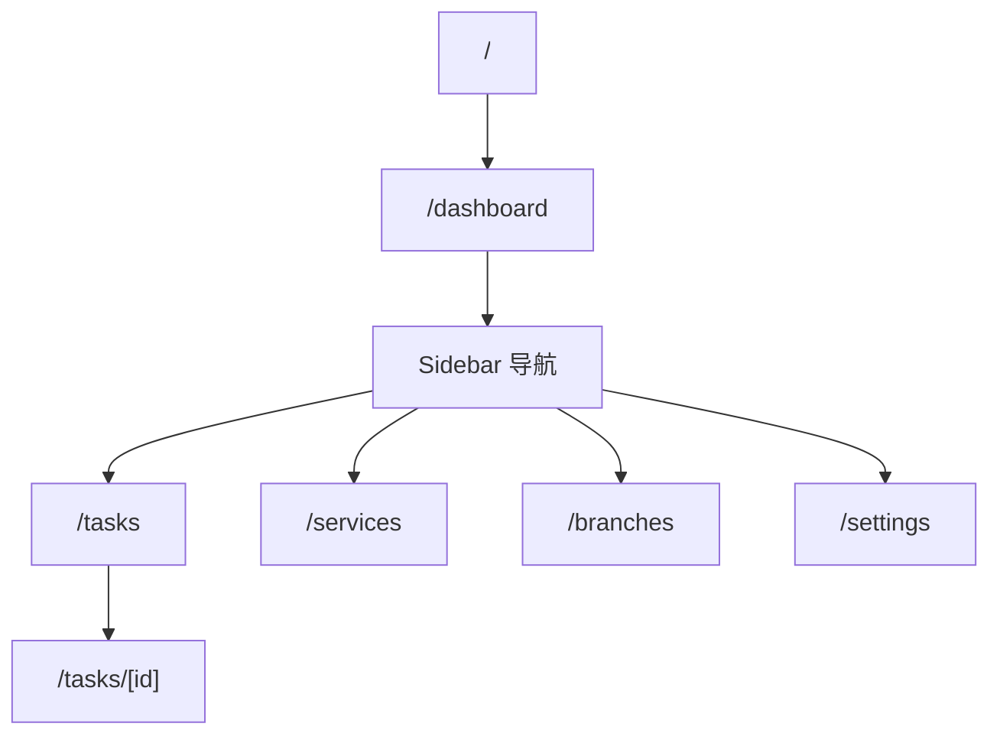
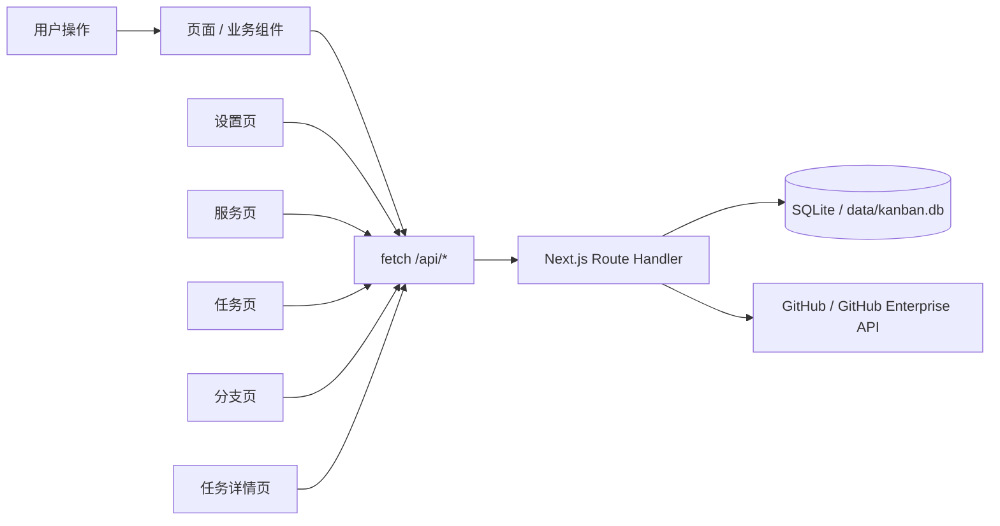
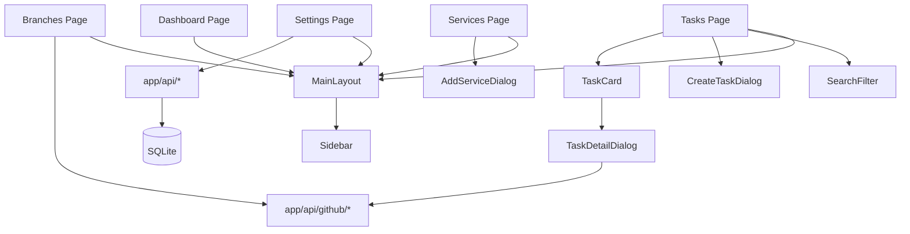

# 项目管理看板 (Kanban Board)

一个基于 **Next.js 15 + React 19 + TypeScript** 的中文项目管理看板。应用当前以 **SQLite + Drizzle ORM + Next.js Route Handler** 为持久化核心，覆盖任务看板、服务登记、分支追踪、GitHub Pull Request 联动和团队概览。

## ✨ 功能概览

- **仪表盘**：统计任务数量、完成率、优先级/状态分布、服务与成员工作量
- **任务看板**：五阶段流转（待规划 → 待开发 → 开发中 → 待审核 → 已完成）、拖拽移动、筛选搜索、批量删除
- **任务详情**：Markdown 描述编辑、服务分支记录、PR 状态查看、测试/主分支差异追踪
- **服务管理**：维护服务名称、仓库地址、测试分支、主分支等配置
- **分支管理**：汇总所有服务分支，发起测试环境 / 生产环境 PR
- **系统设置**：保存 UI 偏好与多套 GitHub / GitHub Enterprise 配置

## 技术栈

- **框架**：Next.js 15 App Router
- **UI**：React 19、TypeScript、Tailwind CSS v4、shadcn/ui、Radix UI、Lucide React
- **编辑器**：`@uiw/react-md-editor`
- **持久化**：SQLite（`data/kanban.db`）+ Drizzle ORM + Route Handler
- **分析**：Vercel Analytics
- **包管理**：pnpm

## 快速开始

### 环境要求

- Node.js 18+
- pnpm 8+

### 安装依赖

```bash
pnpm install
```

### 启动开发环境

```bash
pnpm dev
```

打开 [http://localhost:3000](http://localhost:3000)。首页会自动跳转到 `/dashboard`。

## ✅ 推荐验证命令

```bash
pnpm lint
pnpm typecheck
node --test tests/readme.test.mjs
pnpm build
```

> 当前仓库仅提供一个 README 对齐测试；交付时以 lint / typecheck / README 测试 / build 作为主要验证手段。

## 🌐 页面地图

| 路由 | 说明 | 主要组件 / 源码入口 |
| --- | --- | --- |
| `/` | 启动页，自动跳转到仪表盘 | `app/page.tsx` |
| `/dashboard` | 数据总览、状态/优先级/服务统计 | `app/dashboard/page.tsx` |
| `/tasks` | 主看板页面，包含拖拽、筛选、批量操作 | `app/tasks/page.tsx`、`TaskCard`、`CreateTaskDialog`、`SearchFilter` |
| `/tasks/[id]` | 单任务详情页，支持 Markdown、服务分支和 PR 状态 | `app/tasks/[id]/page.tsx` |
| `/services` | 服务登记与仓库配置 | `app/services/page.tsx`、`AddServiceDialog` |
| `/branches` | 按服务查看分支和部署 PR 流转 | `app/branches/page.tsx` |
| `/settings` | 偏好设置与 GitHub 配置 | `app/settings/page.tsx` |
| `/api/github/*` | 服务端 GitHub 代理接口 | `app/api/github/pull-request/route.ts`、`app/api/github/pr-status/route.ts`、`app/api/github/branch-diff/route.ts`、`app/api/github/check-merge-status/route.ts` |

### 页面导航图



## 🔄 数据流



## 🧩 核心组件协作图



## 持久化模型

核心业务数据保存在 `data/kanban.db` 中，由 `app/api/*` 路由统一读写：

| 表 | 说明 |
| --- | --- |
| `tasks` | 任务主表，保存标题、描述、状态、优先级、负责人、JIRA、时间戳 |
| `service_branches` | 任务下的服务分支，保存 `serviceId`、分支名、PR 状态、分支差异与合并状态 |
| `services` | 服务登记信息，保存仓库地址、测试分支、主分支、依赖 |
| `settings` | 应用设置单例 |
| `github_configs` | GitHub / GitHub Enterprise 配置，含 token，仅服务端读取 |

### Task（摘要）

```ts
interface Task {
  id: string
  title: string
  description: string
  status: "backlog" | "todo" | "in-progress" | "review" | "done"
  priority: "low" | "medium" | "high"
  assignee?: { name: string; avatar?: string }
  jiraUrl?: string
  serviceBranches?: ServiceBranch[]
  createdAt?: string
  updatedAt?: string
}
```

### ServiceBranch（摘要）

```ts
interface ServiceBranch {
  id: string
  taskId?: string
  serviceId?: string
  serviceName: string
  branchName: string
  pullRequestUrl?: string
  mergedToTest?: boolean
  mergedToMaster?: boolean
  prStatus?: PullRequestStatus
  diffStatus?: {
    test?: BranchDiffState
    master?: BranchDiffState
  }
}
```

### Service（摘要）

```ts
interface Service {
  id: string
  name: string
  description: string
  repository: string
  testBranch: string
  masterBranch: string
}
```

### GitHubConfig（摘要）

```ts
interface GitHubConfig {
  id: string
  name: string
  domain: string
  owner: string
  token: string
  isDefault?: boolean
}
```

## 目录结构

```text
kanban-board/
├── app/
│   ├── api/
│   │   ├── import/route.ts
│   │   ├── github/
│   │   │   ├── branch-diff/route.ts
│   │   │   ├── check-merge-status/route.ts
│   │   │   ├── pr-status/route.ts
│   │   │   └── pull-request/route.ts
│   │   ├── services/
│   │   ├── settings/route.ts
│   │   └── tasks/
│   ├── branches/page.tsx
│   ├── dashboard/page.tsx
│   ├── services/page.tsx
│   ├── settings/page.tsx
│   ├── tasks/
│   │   ├── [id]/page.tsx
│   │   └── page.tsx
│   ├── layout.tsx
│   ├── loading.tsx
│   └── page.tsx
├── components/
│   ├── ui/                      # shadcn/ui 基础组件
│   ├── add-service-dialog.tsx
│   ├── create-task-dialog.tsx
│   ├── main-layout.tsx
│   ├── search-filter.tsx
│   ├── sidebar.tsx
│   ├── task-card.tsx
│   └── task-detail-dialog.tsx
├── hooks/
│   ├── use-mobile.ts
│   └── use-toast.ts
├── lib/
│   ├── branch-generator.ts
│   ├── db.ts
│   ├── github-utils.ts
│   ├── import-export.ts
│   ├── schema.ts
│   ├── service-branch-utils.ts
│   ├── service-data.ts
│   ├── task-data.ts
│   ├── task-utils.ts
│   └── utils.ts
├── public/
├── eslint.config.mjs
├── next.config.mjs
├── package.json
└── README.md
```

## 📁 仓库约定

| 约定 | 说明 |
| --- | --- |
| `app/**/page.tsx` | 仅负责页面级组合、状态拼装和路由入口 |
| `components/ui/*` | shadcn/ui 基础组件，尽量保持无业务语义 |
| `components/*.tsx` | 业务组件层，承载对话框、卡片、筛选器等交互 |
| `app/api/tasks/*` / `app/api/services/*` / `app/api/settings/*` | 业务数据的唯一服务端读写边界 |
| `app/api/github/*` | 与 GitHub 通信的唯一服务端边界；不要在客户端直接持有 token |
| `lib/db.ts` / `lib/schema.ts` | SQLite 连接、建表与 Drizzle schema 定义 |
| `lib/*-data.ts` | 数据库行到前端模型的转换层 |
| `lib/*.ts` | 纯工具或无 UI 逻辑的封装，例如分支名生成与导入校验 |
| `@/*` 路径别名 | 统一通过 `@/` 引用根目录模块，避免深层相对路径 |
| 中文文案优先 | UI 文字、README 说明、默认提示均以中文为主 |

### 开发时建议遵守

1. **页面数据统一走 `app/api/*`**，不要在组件里直接操作数据库或私自维护旁路持久化
2. **GitHub 配置保存在数据库中，但 token 只允许服务端读取**；客户端只能通过 `app/api/github/*` 间接访问
3. **新增任务 / 服务字段时，同步检查**：Drizzle schema、Route Handler、前端共享类型、详情页、统计页和 README 数据模型
4. **保持页面职责清晰**：路由层组合、组件层交互、`lib/` 层纯逻辑、`app/api/*` 层数据边界
5. 仓库中存在少量**未接入当前页面流的原型组件**；新增功能前先确认是否为当前主路径的一部分

## GitHub 集成说明

所有 GitHub 请求都通过 `app/api/github/` 下的 Route Handler 转发，支持：

- GitHub.com
- GitHub Enterprise（当 `domain !== github.com` 时，自动走 `https://{domain}/api/v3/...`）

当前接口职责：

- `POST /api/github/pull-request`：创建 PR
- `POST /api/github/pr-status`：查询 PR / CI 状态
- `POST /api/github/branch-diff`：比较分支与测试/主分支差异
- `POST /api/github/check-merge-status`：检查分支是否已经合并

## 构建与发布

```bash
pnpm build
pnpm start
```

默认输出适用于 Next.js 标准部署。若使用 Vercel，可直接导入仓库部署。
