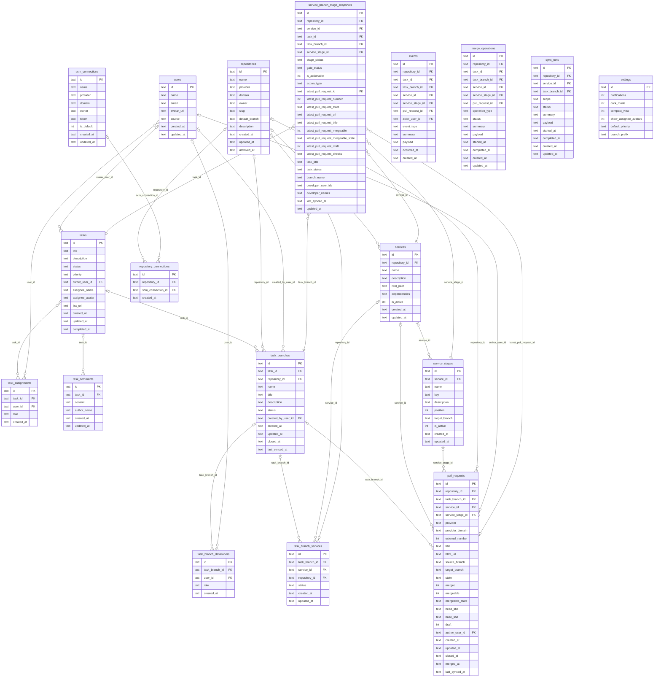
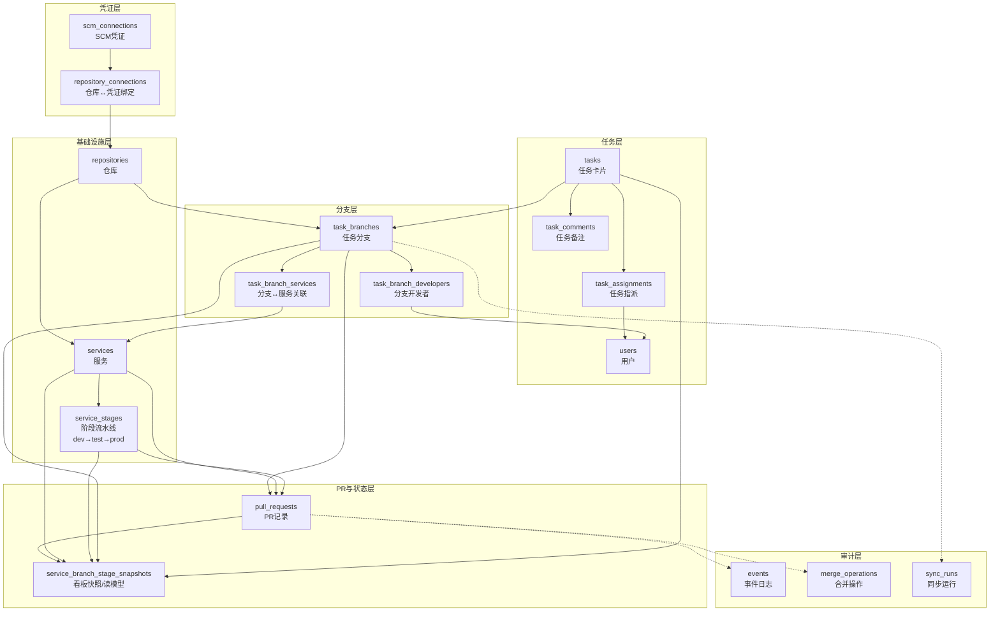
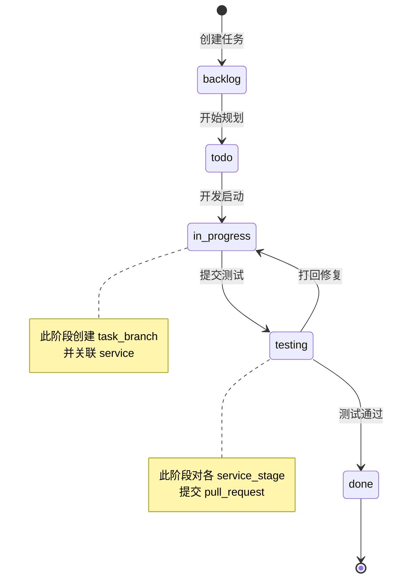
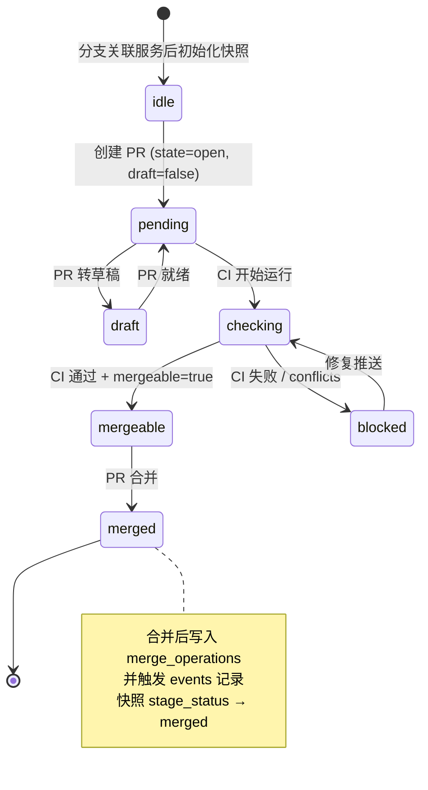

# 项目管理看板 — 系统设计文档

> 技术栈：Next.js 15 App Router · React 19 · TypeScript · Tailwind CSS v4 · SQLite (better-sqlite3 + Drizzle ORM)

---

## 一、整体架构概览

```
┌─────────────────────────────────────────────────────────────┐
│                        前端 (Browser)                        │
│  /dashboard  /tasks  /tasks/[id]  /services/[id]  /branches │
│  /repositories  /settings                                   │
└──────────────────────┬──────────────────────────────────────┘
                       │ HTTP (fetch)
┌──────────────────────▼──────────────────────────────────────┐
│                    Next.js API Routes                        │
│  /api/tasks/**   /api/task-branches/**   /api/services/**   │
│  /api/repositories/**   /api/scm-connections/**             │
│  /api/github/**  (GitHub 代理，避免 CORS & Token 泄露)       │
└──────────────────────┬──────────────────────────────────────┘
                       │ Drizzle ORM
┌──────────────────────▼──────────────────────────────────────┐
│               SQLite  data/kanban.db                        │
│  WAL 模式 · 单例连接 · 启动时自动迁移                         │
└─────────────────────────────────────────────────────────────┘
                       │ HTTPS
┌──────────────────────▼──────────────────────────────────────┐
│         GitHub.com / GitHub Enterprise (SCM)                │
│  Pull Request · Branch Diff · CI Checks · Merge Status      │
└─────────────────────────────────────────────────────────────┘
```

---

## 二、ER 图（完整实体关系）



---

## 三、核心聚合关系图（简化视角）



---

## 四、业务流转状态机

### 4.1 任务状态流转



### 4.2 PR 阶段流水线流转



### 4.3 快照状态字段说明

| 字段 | 可选值 | 含义 |
|------|--------|------|
| `stage_status` | `idle` / `pending` / `merged` / `closed` | 当前阶段整体状态 |
| `gate_status` | `unknown` / `open` / `passing` / `failing` / `blocked` | CI/合并门禁状态 |
| `is_actionable` | `0` / `1` | 是否有可执行动作（创建/合并 PR）|
| `action_type` | `create_pr` / `merge_pr` / `null` | 当前可执行的动作类型 |

---

## 五、索引设计

```
idx_task_branches_task_id                → task_branches(task_id)
idx_task_branches_repository_id          → task_branches(repository_id)
idx_task_branch_services_branch_id       → task_branch_services(task_branch_id)
idx_task_branch_services_service_id      → task_branch_services(service_id)
idx_service_stages_service_id            → service_stages(service_id)
idx_services_repository_name [UNIQUE]    → services(repository_id, name)
idx_service_stages_service_key [UNIQUE]  → service_stages(service_id, key)
idx_service_stages_service_position [UNIQUE] → service_stages(service_id, position)
idx_repository_connections_repo_connection [UNIQUE] → repository_connections(repository_id, scm_connection_id)
idx_pull_requests_branch_stage           → pull_requests(task_branch_id, service_id, service_stage_id)
idx_events_branch_id                     → events(task_branch_id)
idx_merge_operations_branch_id           → merge_operations(task_branch_id)
idx_merge_operations_pull_request_id     → merge_operations(pull_request_id)
idx_sync_runs_scope                      → sync_runs(repository_id, service_id, task_branch_id)
idx_snapshots_service_stage              → service_branch_stage_snapshots(service_id, service_stage_id)
idx_task_comments_task_id                → task_comments(task_id)
```

---

## 六、关键设计决策

### 6.1 `service_branch_stage_snapshots` — 读模型（Read Model）

服务看板主视图（`/services/[id]`）需要同时展示：分支名、开发者、PR 状态、CI 检查、任务标题。若实时 JOIN 多张表，查询复杂且慢。

**解决方案**：快照表冗余所有展示字段，由写入路径（PR 同步、状态变更）主动更新。读取时无需 JOIN，直接 SELECT。

```
写入路径：
  创建/更新 PR → 更新 service_branch_stage_snapshots
  分支关联服务  → 初始化快照行
  同步 CI 状态  → 更新 latest_pull_request_checks 等字段

读取路径：
  /services/[id] 看板 → SELECT * FROM service_branch_stage_snapshots
                         WHERE service_id = ? ORDER BY service_stage_id, updated_at
```

### 6.2 PR 四元组唯一性

一条 PR 记录由以下四个维度共同确定：

```
(task_branch_id, service_id, service_stage_id, repository_id)
```

同一个分支可以对同一服务的不同阶段（dev / test / prod）分别提 PR，记录独立存储，互不干扰。

### 6.3 `task_branch_services` 约束同仓库

`repository_id` 冗余在关联表中，在应用层确保：**分支只能关联同仓库下的服务**，防止跨仓库错误关联。

### 6.4 SCM 凭证解耦

```
repositories ──< repository_connections >── scm_connections
```

一个仓库可绑定多套 SCM 凭证（如同时支持 GitHub.com Token 和 GHE Token）。API 路由会根据仓库的 `domain` 字段自动路由到对应 endpoint：
- `domain = github.com` → `https://api.github.com`
- `domain = ghe.example.com` → `https://ghe.example.com/api/v3`

### 6.5 审计表设计（宽引用模式）

`events`、`merge_operations`、`sync_runs` 均采用**可选外键**模式：所有引用字段（`repository_id`、`task_branch_id` 等）均可为 NULL，记录时按实际上下文填入，方便按任意维度查询历史。

---

## 七、页面与数据来源映射

| 页面路由 | 主要数据来源 | 说明 |
|----------|-------------|------|
| `/dashboard` | `tasks` | 任务统计、状态/优先级分布 |
| `/tasks` | `tasks` + `task_assignments` | 看板五列展示，拖拽改状态 |
| `/tasks/[id]` | `tasks` + `task_branches` + `task_branch_services` + `task_branch_developers` + `pull_requests` + `task_comments` | 任务详情全量信息 |
| `/services/[id]` | `service_branch_stage_snapshots` | 读模型直接驱动，无多表 JOIN |
| `/branches` | `services` | 服务选择入口，跳转至服务主视图 |
| `/repositories` | `repositories` + `repository_connections` + `scm_connections` | 仓库注册与 SCM 绑定管理 |
| `/settings` | `settings` + `scm_connections` | 全局设置与凭证配置 |
